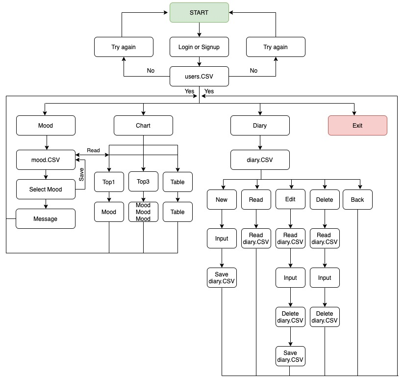
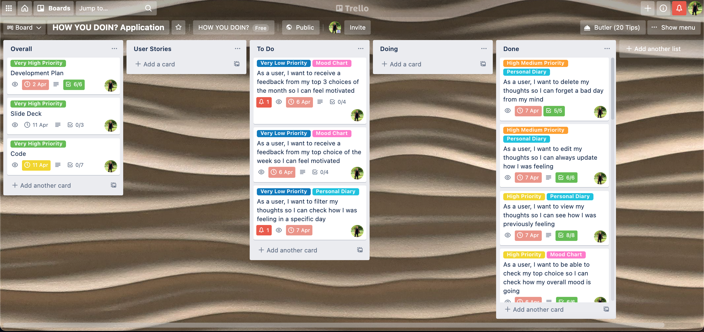
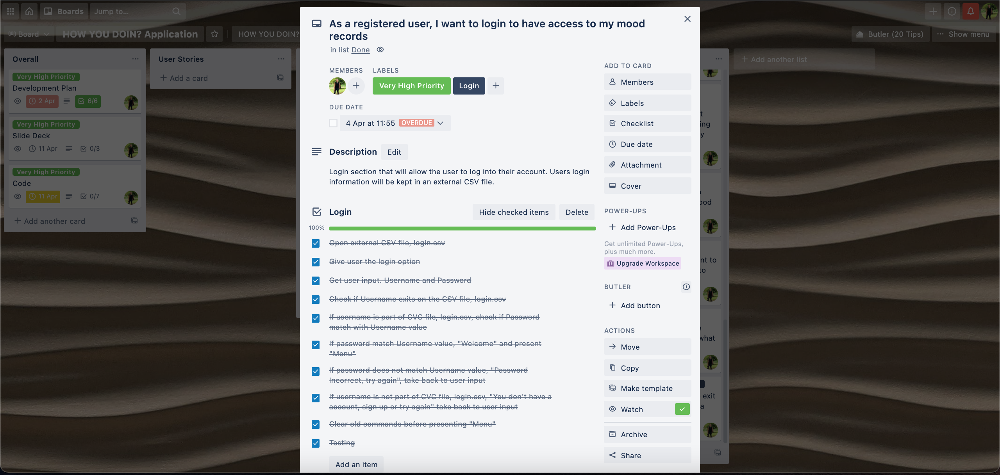

<br>

#### Created by Rafael Mello
# HOW YOU DOIN?

<br>


<br>

#
## Table of Contents
- [Links](###Links)
- [Development, Purpose & Scope](###Development,-Purpose-&-Scope)
- [Feature List](###Features-List)
- [Gems](###Gems)
- [User Interaction & User Experience](###User-Interaction-&-User-Experience)
- [Control Flow Diagram](###Control-Flow-Development)
- [Implementation Plan](###Implementation-Plan)
- [Install](###Install)
- [Usage](###Usage)
- [Help](###Help)
- [Hardware Requirement](###Hardware-Requirement)

<br>

#
### Links
[GitHub Repository](https://github.com/rafaelferreiramello/terminalapplication)

<br>

# 
### Development, Purpose & Scope

<br>

#### Description 

<br>

Inspired by the signature pickup line of character Joey Tribbiani from the TV sitcom "Friends" I developed the application “HOW YOU DOIN?”. But unlike Joey’s flirty intentions, this application honestly want to know... how are you doing today?

“HOW YOU DOIN?” is a mood-tracker application that allows users to share their daily mood, and from this input get an inspirational message to help them get through the day!

The app also helps users to track their mood displaying a user’s Top1 or Top3 charts and a table with all the moods input. And there is a journal feature that allows user to put down a few thoughts.

<br>

#### Problem 

<br>

Mental health is a growing concern and has been affecting directly or indirectly many individuals. Mental health is vital to our well-being - it allows us to think, learn and interact meaningfully with others.

In many cases, the lack of a supportive surroundings increase this matter and what we all want is just a good friend to listen and advise us in a positive way. Unfortunately, this is not always a reality.

This is why "HOW YOU DOIN?"  was designed. This application is a very helpful and a safe way of offering support for people to manage their negative thoughts and develop a strategy to avoid negative attitude.

<br>

#### Audience

<br>

Users who are seeking to identify and improved their mood patterns over time. 18 to 35 years old, tech- aware and equipped with a computer. All ethnicity, gender, religion and sexuality. English speakers (planning to translate to other languages in the future). 

<br>

#### Usage

<br>

Daily input from the user. User should see the application as a “take care of yourself” moment. Users will access the application via the terminal client (ex: Terminal on Mac or Command Prompt/Powershell on Windows) and they will need to have Ruby installed. Some basic knowledge of how to run an application on the terminal is necessary. 

After the application started the instructions will be output by the program and the user will have to interact and input data according to their needs. 

<br>

#
### Features List

<br>

#### Feature I

<br>

**Login/Signup**  

When starting the application, the user will be greeted with the name of the application and the options "login" or "signup". If the user is already registered user must type login, and if not, user must type signup. For both options, the user will be asked for their “username” and “password”. 

Login option, If user type a wrong username or password, an error message will be displayed and user will have to return to login or signup option. Signup option, If user type an existing username, an error message will be displayed and user will have to return to login or signup option. After successful login/signup, the user will be presented with a clear and concise menu.

<br>

#### Feature II

<br>

**Mood**

Offers feedback based on a user’s input. Gives user 5 “mood” options using tty-prompt gem. Each “mood” option will have an array with various motivation messages and will be selected in a random mode and output to the user after the selection. Only the content related to the logged in user will be manipulated.

<br>

#### Feature III

<br>

**Chart**

Displays a person’s mood in a Top1 or Top3 charts and a table. User input will be stored in an external text file that will be accessed when this option is selected. Top1 will show you the topmost selected mood of all time. And the Top3 will show you the top 3 most selected moods. The table will output all of the moods ever selected, and the respective frequency of that particular mood. Only the content related to the logged in user will be manipulated.

<br>

#### Feature IV

<br>

**Diary**

Personal diary. User notes will be kept in a separate external text file that will have the date of insertion and the user text input. You will be able to read all the messages through the terminal, edit and delete them. Only the content related to the logged in user will be manipulated.

<br>

#

### Gems

<br>

* TTY-Prompt
* TTY-Table
* TTY-Font
* Pastel
* Colorize
* Test-Unit

<br>

#
### User Interaction & User Experience

<br>

When starting the application, the user will be greeted with the name of the application and the options "Login" or "Sign-up". If the user is already registered you must type login, and if not, the user must type signup. For both options, the user will be asked for their “username” and “password”. 

Login option, If user type a wrong username or password, an error message will be displayed and user will have to return to login or signup option. Signup option, If user type an existing username, an error message will be displayed and user will have to return to login or signup option.

After successful login/signup, the user will be presented with a clear and concise menu. Within the menu there will be 4 options, “MOOD”, “CHART”, “DIARY” and “EXIT”. To select one of the options, the user must use the arrow keys to navigate between the options and press “ENTER” to select.

**“MOOD” option:** After selecting the “MOOD” option, the program presents 5 mood options for the user to choose from. As in the main menu, the user must use the arrow keys to navigate between moods and press “ENTER” to select. The program will return a message related to the chosen mood and will forward it back to the main menu.

**“CHART” option:** After selecting the “CHART” option, the program presents 3 options for the user to choose from. “TOP1”, “TOP3” and “TABLE”. Again, the user must use the arrow keys to navigate between the options and press “ENTER” to select. The first option will return the most frequent mood in their choices and how many times that mood has been entered. The second option will do the same, but returning the 3 most frequent moods. And the option “TABLE” will return a table with all the moods inserted in the application and the number of times that such information was inserted. In all options, the user will automatically be taken back to the main menu.

**“DIARY” option:** After selecting the “DIARY” option, the program presents 5 options for the user to choose from. "NEW", "READ", "EDIT", "DELETE" AND "BACK”. The user must use the arrow keys to navigate between the options and press "ENTER" to select.

In the **"NEW"** option, the program will ask the user to input in text how they are feeling, and after pressing enter this input will be saved and the user will be sent back to the main menu.

If the **“READ”** option is chosen, all written messages will be printed on the screen with their respective publication date and the user will be taken back to the main menu. 

In the **“EDIT”** option, all their publications will be displayed on the screen with a corresponding number, and the user must insert the number of the publication in the program that they want to change and press “ ENTER ”, then the program will ask the user to re-enter a text message for that publication, after pressing“ ENTER ”the publication will be saved and the user will be forwarded to the main menu.

In the **“DELETE”** option, the same will occur as in the previous option, but after inserting the publication number, the publication will be deleted and the user will be sent back to the main menu.

**“EXIT” option:** After selecting the “EXIT” option, the program ends.

**All error messages will be display in RED to make visible to the user.**

<br>

#
### Control Flow Development

<br>

**Control Flow Diagram**



<br>

#

<br>

### Implementation Plan

<br>

[Link to Trello Board](https://trello.com/b/XIzuyjsK/how-you-doin-application)

<br>

Screenshot of Trello Board on day before submission:




<br>

#
### Install

1. Make sure you have ruby installed, you can find the information [here](https://www.ruby-lang.org/en/documentation/installation/).
2. Open a terminal / CLI.
3. Navigate to or create a directory you want "HOW YOU DOIN?" to be installed.
4. Once in that directory, run ```$ git clone git@github.com:rafaelferreiramello/terminalapplication.git``` to clone a copy of "HOW YOU DOING?" into your computer.
5. Before application can run, make sure you are inside the application directory and run ```$ bundle install``` 
6. Make sure you are inside the application directory and run ```$ ./install_script.sh```

<br>

#
### Usage

After installed, for daily use, open your terminal, make sure you are inside application directory and run ```ruby main.rb```

<br>

#
### Help

Open your terminal and run the following command ```ruby main.rb --help``` for more instructions about "HOW YOU DOIN?"

<br>

#
### Hardware Requirement

Some features like the menus may not work on Windows when run from Git Bash.
